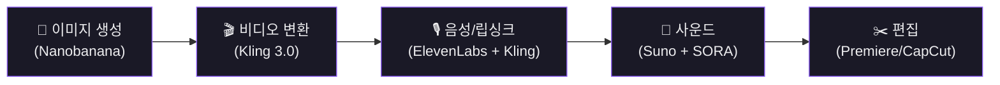

# Part 0. 시작하기 전에

## 생성형 AI 준비물

  

    
🎨

    
이미지 생성

    
Nanobanana Pro / 2

    
캐릭터, 배경, 스토리보드 이미지 (Freepik/Higgsfield API 경유)

  

  

    
🎬

    
비디오 생성

    
Kling 3.0

    
Image-to-Video, 립싱크, 캐릭터 바인딩

  

  

    
🎙️

    
음성 생성

    
ElevenLabs

    
내레이션, 보이스오버

  

  

    
🎵

    
배경음악

    
Suno

    
인스트루멘탈 BGM

  

  

    
💥

    
효과음

    
SORA 2 / Kling 3.0

    
환경음, SFX

  

  

    
✍️

    
시나리오 보조

    
Claude / Gemini

    
시나리오 작성, 검토, 번역

  

## 핵심 원칙: Image-to-Video 방식

  ❌ Text → Video 
  ✅ Image → Video 
  이미지 생성 단계에서 거의 모든 것을 결정

- **Text-to-Video가 아닌 Image-to-Video**가 현 시점 최선의 방법
- 이미지 생성 단계에서 배우, 배경, 조명, 미술, 촬영에 해당하는 거의 모든 것을 결정
- 이미지 생성 모델은 현재 Google Nanobanana 계열이 가장 뛰어남

## API 서비스 활용

- **Freepik, Higgsfield** 같은 API 서비스로 여러 AI를 하나의 구독으로 이용
- 장점: 비용 효율적, 다양한 모델 접근
- 단점: 본 서비스의 100% 기능 미제공, 트래픽 우선순위 낮음
- **Kling 본 서비스 별도 구독 필요**: 립싱크, 캐릭터 바인딩 기능은 API에서 미지원

  

    
API 서비스 (Freepik/Higgsfield)

    
✓ 비용 효율적 (하나의 구독)

    
✓ 다양한 모델 접근

    
✗ 100% 기능 미제공

    
✗ 트래픽 우선순위 낮음

  

  

    
본 서비스 직접 구독

    
✓ 전체 기능 사용 가능

    
✓ 립싱크, 캐릭터 바인딩

    
✗ 개별 구독 비용

    
✗ 서비스별 별도 관리

  

## 기타 준비물

- **편집 프로그램**: Premiere Pro / CapCut(초보 추천) / Final Cut Pro
- **업스케일러**: Topaz (720p~1080p → 4K)
- **스토리보드 도구**: Figma (무료, 넓은 캔버스에 이미지 자유 배치)
