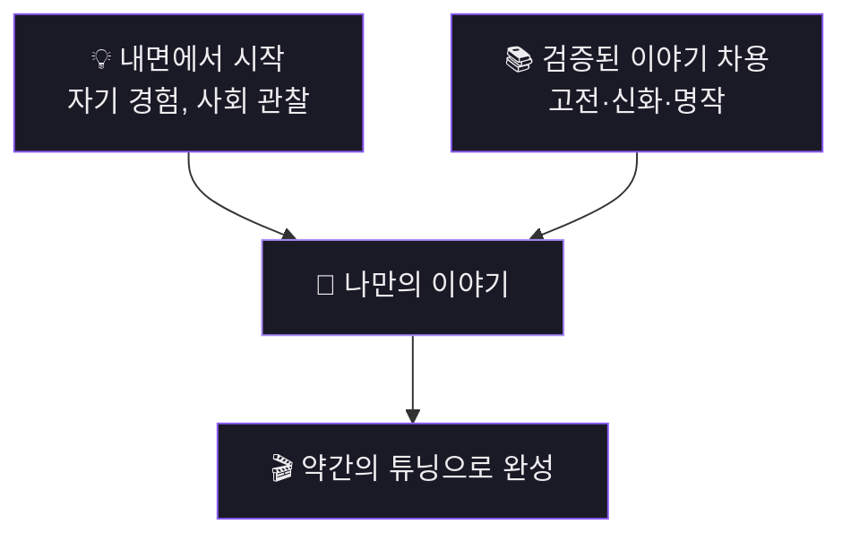

# Part 1. 시작

## 이야기의 출발점

1. **내면에서 시작**: 자기 자신, 인생, 사회에 대해 느낀 바를 메모하듯 써보기
2. **검증된 이야기 차용**: 고전(성경, 그리스로마신화, 삼국지 등)을 현대적으로 각색
   - 타이타닉 = 침몰하는 배 위의 로미오와 줄리엣
   - 마션 = 화성판 로빈슨 크루소
3. **결론**: `<내가 익숙한 분야>` + `<이미 잘 짜여진 이야기>` → 약간의 튜닝

  &lt;내가 익숙한 분야&gt; + &lt;이미 잘 짜여진 이야기&gt; 
  → 약간의 튜닝 → 나만의 시나리오

## LLM 활용

- ChatGPT, Gemini, Claude로 시놉시스 → 시나리오 → 대본 전환 가능
- 글쓰기 능력에 따라 역할 조절 (시나리오 작가 vs 어시스턴트)
