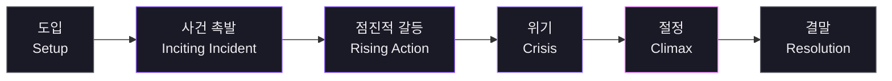
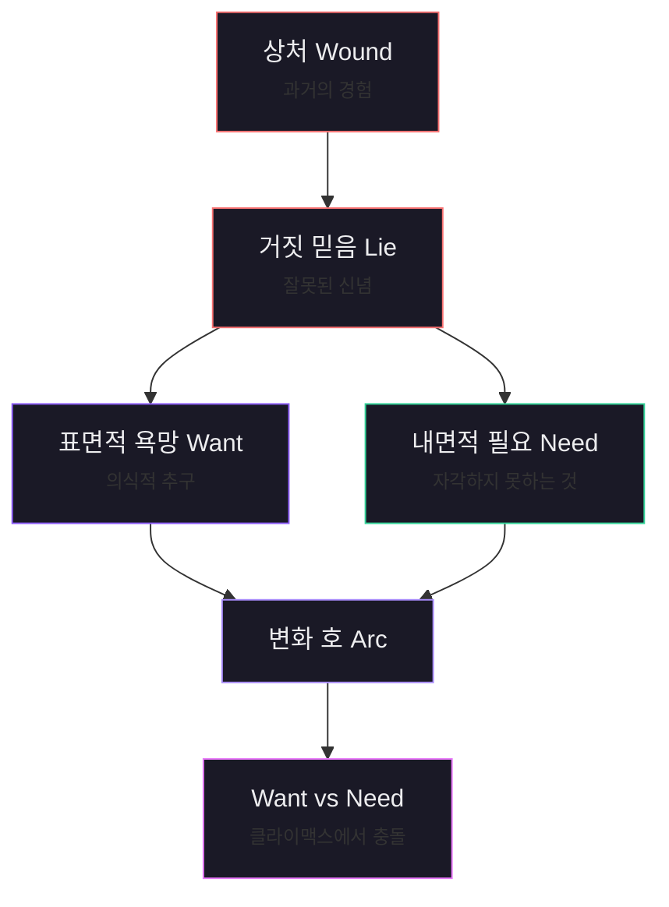
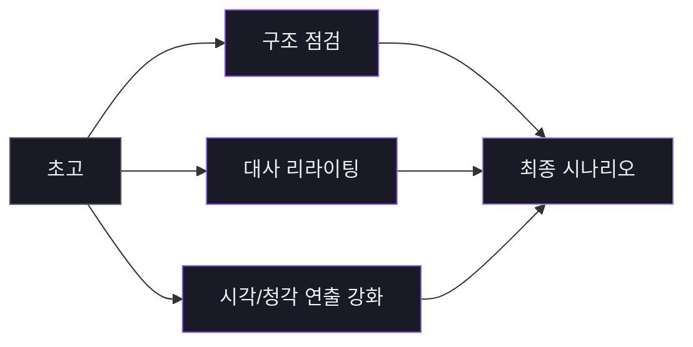
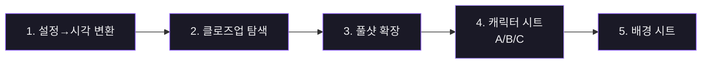

# Part 2. 시나리오 작성

## 시나리오의 6단계 서사 구조



## 7단계 워크플로우: 시놉시스에서 시나리오까지

<div class="step-flow">
  <div class="step-item"><span class="step-num">1</span><span class="step-text">시놉시스 분석</span></div>
  <span class="step-arrow">→</span>
  <div class="step-item"><span class="step-num">2</span><span class="step-text">세계관·톤</span></div>
  <span class="step-arrow">→</span>
  <div class="step-item"><span class="step-num">3</span><span class="step-text">캐릭터 설계</span></div>
  <span class="step-arrow">→</span>
  <div class="step-item"><span class="step-num">4</span><span class="step-text">비트시트</span></div>
  <span class="step-arrow">→</span>
  <div class="step-item"><span class="step-num">5</span><span class="step-text">시퀀스 확장</span></div>
  <span class="step-arrow">→</span>
  <div class="step-item"><span class="step-num">6</span><span class="step-text">시나리오 초고</span></div>
  <span class="step-arrow">→</span>
  <div class="step-item"><span class="step-num">7</span><span class="step-text">리라이팅</span></div>
</div>

---

### 1단계: 시놉시스 분석 및 핵심 요소 추출

> 시놉시스를 해부하여 이야기의 뼈대가 될 핵심 요소들을 식별. 여기서 추출한 요소들이 이후 모든 단계의 기준점.

**프롬프트 예시:**

```
다음은 내가 구상 중인 영화의 짧은 시놉시스야.

[시놉시스 전문을 여기에 붙여넣기]

이 시놉시스를 분석해서 아래 항목들을 추출해줘.

- 중심 갈등 (주인공이 원하는 것 vs 방해하는 것)
- 주제 의식 (이 이야기가 궁극적으로 말하고자 하는 것)
- 장르적 기대 (관객이 이 장르에서 기대하는 관습적 요소)
- 감정 곡선의 방향 (시작과 끝에서 관객이 느낄 감정의 변화)
- 현재 시놉시스에서 빠져 있거나 모호한 부분
```

- **왜**: "시놉시스를 발전시켜줘"라고 하면 AI가 자기 마음대로 써버림. 핵심 요소를 먼저 추출하면 기준선 확보.
- **주의**: "주제 의식"은 작가 본인만 정할 수 있는 영역. AI 분석은 참고자료일 뿐.

---

### 2단계: 세계관과 톤 설정

> 이야기가 존재하는 세계의 규칙과 영화의 전반적인 분위기를 확정.

**프롬프트 예시:**

```
1단계에서 정리한 핵심 요소를 바탕으로, 이 영화의 세계관과 톤을 설계해줘.

[1단계 정리 내용 붙여넣기]

다음 항목들을 구체적으로 설정해줘.

- 시간적 배경: 구체적 연도 또는 시대, 계절, 하루 중 주요 시간대
- 공간적 배경: 도시/시골, 실내/실외 비율, 핵심 장소 3~5곳과 각 장소의 상징적 의미
- 세계의 규칙: 이 세계에서만 통하는 특수한 규칙이나 설정 (SF/판타지의 경우 필수)
- 톤: 레퍼런스 영화 2~3편과 함께 이 영화만의 고유한 톤을 한 문장으로 정의
- 시각적 키워드: 색감, 조명 스타일, 카메라 움직임의 전반적 방향
- 청각적 키워드: 음악 장르, 환경음의 역할, 침묵의 활용 방식

내가 생각하는 톤의 방향은 [작가의 톤 방향]이야. 이 방향을 기준으로 구체화해줘.
```

- **왜**: 톤이 불명확하면 장면마다 분위기가 흔들림.
- **주의**: 레퍼런스 영화는 장르가 아니라 톤과 분위기가 유사한 것을 선택 (블레이드 러너 ≠ 인터스텔라)

---

### 3단계: 캐릭터 설계

> 주요 인물들의 내면 구조를 설계. 이후 행동과 대사가 캐릭터 본질에서 자연스럽게 흘러나오도록.



**프롬프트 예시:**

```
이 영화의 주요 캐릭터들을 설계해줘. 각 캐릭터에 대해 아래 항목을 모두 작성해줘.

[1단계, 2단계 정리 내용 붙여넣기]

각 캐릭터별 설계 항목:

- 이름, 나이, 외형적 특징 (촬영 시 시각적으로 구별 가능한 요소)
- 표면적 욕망 (Want): 이 캐릭터가 의식적으로 추구하는 것
- 내면적 필요 (Need): 이 캐릭터가 진짜로 필요하지만 자각하지 못하는 것
- 거짓 믿음 (Lie): 이 캐릭터가 이야기 시작 시점에 믿고 있는 잘못된 신념
- 상처 (Wound): 거짓 믿음을 형성하게 만든 과거의 경험
- 변화 호 (Arc): 이야기를 통해 이 캐릭터가 어떻게 변하는지 (또는 변하지 않는지)
- 말투와 언어 습관: 다른 캐릭터와 구별되는 대사 스타일
- 다른 캐릭터와의 관계 역학

주인공은 [간단한 주인공 설명]이고, 이 캐릭터의 핵심은 [작가가 생각하는 캐릭터 핵심]이야.
```

- **왜**: Want → Need 깨달음이 이야기의 뼈대. Lie/Wound가 캐릭터의 모든 선택과 반응의 근원.
- **주의**: AI는 모든 캐릭터를 완성시키려 함 → 변하지 않거나 추락하는 캐릭터도 필요.

---

### 4단계: 3막 구조 설계 (비트시트)

> Save the Cat 비트시트 기반으로 시놉시스를 영화적 구조로 변환.

**프롬프트 예시:**

```
지금까지 정리한 세계관, 톤, 캐릭터를 바탕으로 이 영화의 비트시트를 작성해줘.

[1~3단계 정리 내용 전체 붙여넣기]

Save the Cat 비트시트 구조를 기본으로 하되, 아래 사항을 반영해줘.

각 비트마다 포함할 내용:
- 비트 이름과 해당 비트의 기능적 역할 (왜 이 비트가 여기 있어야 하는지)
- 이 비트에서 발생하는 핵심 사건 (1~2줄)
- 이 비트에서 주인공의 내면 상태 변화
- 이 비트의 예상 러닝타임 비중 (전체 대비 퍼센트)
- 이 비트에서 관객이 느끼는 주된 감정

전체 러닝타임은 [목표 러닝타임, 예: 90분 / 15분 단편]을 기준으로 해줘.

특히 주의할 점:
- 미드포인트가 단순한 사건이 아니라 주인공의 인식 전환이 되어야 해
- All Is Lost 비트가 1막에서 설정한 거짓 믿음의 직접적 결과여야 해
- 클라이맥스에서 주인공의 Want와 Need가 충돌해야 해
```

- **왜**: 비트시트 없이 바로 쓰면 중반부에서 길을 잃고 결말을 급하게 마무리 (용두사미).
- **주의**: "이 사건이 이 캐릭터의 성격상 자연스러운 선택인가?" 반드시 점검. 구조보다 캐릭터가 우선.

---

### 5단계: 시퀀스 아웃라인 확장

> 비트시트의 각 비트를 구체적인 씬들의 연속으로 풀어냄. 비트 2~3개씩 끊어서 작업.

**프롬프트 예시:**

```
비트시트의 [특정 비트, 예: 1막 - Opening Image부터 Catalyst까지]를
씬 단위 시퀀스 아웃라인으로 확장해줘.

[해당 비트시트 내용 붙여넣기]
[세계관, 캐릭터 설정 중 이 구간에 관련된 내용 붙여넣기]

각 씬마다 아래 항목을 포함해줘:

- 씬 번호와 장소 (INT/EXT. 장소 - 시간)
- 등장 캐릭터
- 이 씬의 목적 (정보 전달, 갈등 심화, 감정 전환 등 — 반드시 하나 이상)
- 핵심 사건 (2~3줄)
- 이 씬이 끝날 때 관객이 알게 되는 새로운 정보
- 다음 씬으로의 전환 방식 (컷, 디졸브, 시간 점프 등)

한 번에 전체를 다 하지 말고, 비트 2~3개 단위로 나눠서 작업하자.
```

- **왜**: 전체를 한 번에 확장하면 후반 품질이 떨어짐. 모든 씬은 최소 두 가지 이상 기능 수행 필수.
- **주의**: 씬 사이의 전환에 주의. 시간 점프가 너무 많거나 같은 리듬으로 끝나면 교정.

---

### 6단계: 씬 단위 시나리오 초고 작성

> 카메라가 보는 것과 마이크가 듣는 것만 작성. 소설이 아닌 영화적 글쓰기.

**프롬프트 예시:**

```
시퀀스 아웃라인의 씬 [번호]~[번호]를 시나리오 형식으로 작성해줘.

[해당 씬의 아웃라인 붙여넣기]
[관련 캐릭터 설정 붙여넣기]
[세계관과 톤 설정 붙여넣기]

시나리오 작성 규칙:

1. 포맷: 표준 시나리오 형식을 따를 것
   - 씬 헤딩: INT./EXT. 장소 - 시간
   - 지문(Action): 현재 시제, 능동태, 카메라가 보는 것만 서술
   - 대사: 캐릭터 이름 중앙 정렬, 대사 들여쓰기
   - 괄호 지시(Parenthetical): 최소한으로 사용

2. 지문 원칙:
   - 한 문단 4줄을 넘기지 않을 것
   - 감정이나 생각을 직접 서술하지 말 것 (행동과 표정으로 보여줄 것)
   - 사운드 디자인을 암시하는 환경 묘사를 포함할 것
   - "우리는 본다(We see)" 같은 카메라 의식적 표현은 쓰지 말 것

3. 대사 원칙:
   - 캐릭터마다 고유한 말투 패턴을 유지할 것
   - 서브텍스트를 활용할 것 (캐릭터가 진짜 하고 싶은 말은 직접 하지 않는다)
   - 대사로 정보를 전달할 때는 갈등 상황 속에서 자연스럽게 녹일 것
   - 독백은 최소화하고, 대사 없이 행동으로 보여줄 수 있는 것은 대사를 뺄 것

4. 이 구간의 감정 온도: [예: 긴장감이 서서히 올라가는 구간]
5. 이 구간의 페이싱: [예: 빠르게 / 느리게 호흡하며 / 점진적 가속]
```

- **왜**: 시나리오 작성 규칙을 매번 포함하는 이유는 AI가 대화가 길어지면 초기 설정을 잊어버리기 때문. 씬 3~5개씩 끊어서 작업 권장.
- **초고 3대 문제점**:
    1. 대사가 너무 설명적 → 감정을 말로 직접 설명하는 대사는 즉시 교정
    2. 지문이 소설처럼 내면 서술 → "그녀는 슬픔을 느꼈다" → "그녀의 손이 떨린다"
    3. 씬 시작/끝이 너무 정직 → 씬 중간에 들어가서 핵심만 보여주고 중간에 나올 것

---

### 7단계: 리라이팅과 다듬기

> 구조, 대사, 연출을 분리해서 각각 별도 패스로 점검.



**프롬프트 예시 — 구조적 점검:**

```
아래 시나리오의 [특정 구간]을 구조적 관점에서 분석해줘.

[시나리오 해당 구간 붙여넣기]

분석 기준:
- 각 씬이 전체 이야기에서 제거해도 플롯에 영향이 없는 씬이 있는가?
- 정보 전달 타이밍이 적절한가? (너무 이르거나 너무 늦게 공개되는 정보)
- 긴장감의 상승과 이완이 리듬감 있게 교차하는가?
- 각 씬이 최소 두 가지 이상의 기능을 수행하고 있는가?
```

**프롬프트 예시 — 대사 리라이팅:**

```
아래 씬의 대사를 리라이팅해줘.

[해당 씬 붙여넣기]

리라이팅 방향:
- [캐릭터 A]의 대사에서 서브텍스트를 강화해줘. 이 캐릭터는 지금 [실제 감정]을
  느끼고 있지만, 말로는 [표면적으로 하는 말]을 하고 있어.
- 설명적 대사를 행동이나 반응으로 대체해줘.
- 대사의 길이를 전반적으로 줄여줘. 한 캐릭터의 대사가 3줄을 넘기지 않도록.
- 각 캐릭터의 말투 차이가 뚜렷해지도록 조정해줘.
```

**프롬프트 예시 — 시각/청각 연출 강화:**

```
아래 씬의 지문을 시각적·청각적으로 더 풍부하게 리라이팅해줘.

[해당 씬 붙여넣기]

방향:
- 이 씬의 감정을 전달할 수 있는 환경음이나 사운드 디자인 요소를
  지문에 자연스럽게 녹여줘
- 조명이나 색감의 변화를 암시하는 시각적 묘사를 추가해줘
- 단, 카메라 앵글이나 편집 지시를 직접 쓰지는 말고, 지문의 묘사 순서와
  초점을 통해 자연스럽게 카메라 움직임을 암시해줘
```

- **주의**: 리라이팅 요청 시 "유지해야 할 요소"와 "수정해야 할 요소"를 명시적으로 구분해야 함. AI가 잘 표현된 부분까지 수정해버리는 경우 있음.

### AI 협업 팁
- 하나의 대화 세션에서 전체 시나리오 완성하지 않기
- 단계별로 대화를 나누고, 새 대화마다 이전 결과물 요약을 컨텍스트로 제공

---

## 캐릭터 레퍼런스 생성 (5단계)



### 1. 캐릭터 설정 → 시각적 속성 변환

**프롬프트:**

```
아래는 내 영화 시나리오의 주요 캐릭터 설정이야.

[캐릭터 설정 전체 붙여넣기 — 이름, 나이, 성격, 배경, Want/Need/Lie, 변화 호 등]
[세계관과 톤 설정 붙여넣기]

이 캐릭터를 AI 이미지 생성 도구로 만들기 위해, 시각적 속성으로 변환해줘.
각 캐릭터마다 아래 항목을 모두 작성해줘.

1. 얼굴 특징
   - 얼굴형 (둥근형, 각진형, 타원형 등)
   - 눈의 특징 (크기, 형태, 눈매, 눈동자 색)
   - 코와 입의 특징
   - 피부톤 (구체적인 색조)
   - 헤어스타일 (길이, 색상, 질감, 가르마 방향)
   - 이 캐릭터의 성격이 얼굴에 드러나는 방식
     (예: 습관적으로 눈을 약간 찡그리는, 입꼬리가 미세하게 올라간 등)

2. 체형과 자세
   - 키와 체형 (구체적 수치보다는 비율과 인상)
   - 기본 자세 (어깨의 높이, 등의 곡선, 무게 중심의 위치)
   - 이 캐릭터의 내면이 신체에 드러나는 방식
     (자신감 있는 인물의 열린 자세, 방어적인 인물의 닫힌 자세 등)

3. 의상 설계
   - 기본 의상: 영화 전반에 걸쳐 가장 자주 입는 옷
   - 의상의 색상 팔레트 (영화의 전체 컬러 팔레트와 어떻게 연동되는지)
   - 질감과 소재 (면, 가죽, 실크, 낡은 정도 등)
   - 소품: 항상 지니고 다니는 물건 (시계, 목걸이, 가방 등)

4. 시각적 차별점
   - 이 캐릭터를 다른 캐릭터와 한눈에 구별할 수 있는 시각적 특징 1~2가지
   - 영화적 조명 하에서 이 캐릭터가 가장 잘 보이는 조건
     (예: 역광에서 윤곽이 강조되는 인물, 측광에서 입체감이 살아나는 인물)

중요: 이미지 생성 프롬프트에 바로 쓸 수 있는 구체적 시각 묘사로 작성해줘.
"매력적인 외모" 같은 추상적 표현 대신,
"높은 광대뼈와 깊은 눈, 약간 비대칭인 입술" 같은 구체적 묘사가 필요해.
```

### 2. 초기 얼굴 탐색 (클로즈업)

**프롬프트:**

```
아래 캐릭터의 시각적 설정을 바탕으로,
Nano Banana Pro / Nano Banana 2를 위한 클로즈업 프롬프트를 작성해줘.

[해당 캐릭터의 시각적 속성 붙여넣기]

프롬프트 조건:
- 배경: 오프화이트(미색) 단색 배경
- 조명: 부드러운 디퓨즈드 라이트, 미묘한 그림자가 얼굴의 입체감을 살리는 정도
- 프레이밍: 클로즈업 (어깨 상단부터 머리 위까지)
- 시선: 카메라를 약간 비스듬히 바라보는 3/4 앵글
- 표정: 이 캐릭터의 기본 상태를 드러내는 중립적 표정
- 기술적 키워드: photorealistic, 8K detail, shallow depth of field, studio lighting
- 분위기: 캐스팅 오디션 헤드샷의 느낌

코드박스에 프롬프트만 출력, 따옴표 제외.
```

- **핵심**: 오프화이트 배경 + 디퓨즈드 라이트 → AI 연산 자원이 온전히 얼굴 디테일에 집중
- **여러 모델 비교**: 동일 프롬프트를 Grok, Midjourney, Nanobanana 등에 입력하여 비교
- **선택 기준**: ① 설정 일치도 ② 연기 가능성 (감정 범위 상상 가능한가) ③ **재생산 가능성** (일관성 유지 가능한가)
- **파일명 규칙**: `jiwon_face_v03.png` — 마음에 드는 이미지 즉시 저장

### 3. 풀샷 확장

**프롬프트:**

```
아래 캐릭터의 풀샷 프롬프트를 작성해줘.
이미 클로즈업 레퍼런스가 확정된 상태야.

[해당 캐릭터의 체형, 자세, 의상 설정 붙여넣기]

프롬프트 조건:
- 레퍼런스: [업로드할 클로즈업 이미지를 참조하여] 이 인물의 전신
- 배경: 오프화이트(미색) 단색 배경
- 조명: 부드러운 전신 스튜디오 조명, 바닥에 미묘한 그림자
- 프레이밍: 풀샷 (머리 위부터 발끝까지, 여백 포함)
- 자세: 이 캐릭터의 기본 자세 (Step 1에서 정의한 대로)
- 의상: 기본 의상 상세 묘사
- 소품: 항상 지니고 있는 물건
- 기술적 키워드: photorealistic, full body shot, fashion editorial lighting, off-white background
- 반드시 포함할 지시: "Keep the facial features exactly the same as the reference image"

코드박스에 프롬프트만 출력, 따옴표 제외.
```

- Nanobanana의 핵심 기능: 클로즈업 이미지를 레퍼런스로 업로드하면 얼굴 특징을 유지하며 전신 확장
- 1~2장이면 충분

### 4. 캐릭터 시트 (A/B/C 카테고리)

| 카테고리 | 내용 | 장수 |
|----------|------|------|
| A. 앵글 변화 | A1.정면, A2.3/4좌, A3.측면, A4.3/4우, (A5.후면) | 4~5장 |
| B. 표정 변화 | B1.중립, B2~B4.핵심 감정 1~3, B5.미묘한 감정 | 3~5장 |
| C. 풀샷 | C1.기본 자세, (C2.동적 자세) | 1~2장 |

> **3x3 그리드로 만들지 않는다** — 해상도가 1/9로 분산되어 디테일 저하. 각 패널을 개별 고해상도 이미지로 생성 후 별도 관리.

**프롬프트:**

```
아래 캐릭터의 멀티 패널 캐릭터 시트용 프롬프트를 작성해줘.

[시각적 속성 붙여넣기]
[시나리오 비트시트에서 이 캐릭터의 핵심 감정 순간들 붙여넣기]

이미 확정된 레퍼런스:
- 정면 클로즈업 (A1): 확정 완료 — 이 이미지를 기준으로 모든 패널의 얼굴 일관성 유지
- 기본 풀샷 (C1): 확정 완료

추가 생성이 필요한 패널들의 프롬프트를 각각 작성해줘:

1. A2 — 3/4 앵글 (좌측)
2. A3 — 측면 프로필 (좌측)
3. A4 — 3/4 앵글 (우측)
4. B2 — [핵심 감정 1, 예: 공포에 질린 표정]
5. B3 — [핵심 감정 2, 예: 조용한 결의]
6. B4 — [핵심 감정 3, 예: 깊은 슬픔]
7. B5 — [미묘한 감정, 예: 무언가를 숨기고 있는 듯한 불안]

프롬프트 공통 조건:
- 배경: 오프화이트(미색) 단색 배경
- 조명: 부드러운 디퓨즈드 스튜디오 조명, 미묘한 그림자
- 모든 프롬프트 첫 문장: "Maintaining exact facial identity from the reference image"
- 앵글 변화 패널(A2~A4): 표정은 중립 유지, 앵글만 변화
- 표정 변화 패널(B2~B5): 앵글은 정면 또는 3/4 유지, 표정만 변화
- 각 프롬프트는 독립적으로 실행 가능하도록 캐릭터 외형 묘사를 매번 포함
- 기술적 키워드: photorealistic, studio portrait, soft diffused lighting, off-white background

코드박스에 프롬프트만 출력, 따옴표 제외. 프롬프트 사이에 패널 번호를 표시해줘.
```

**파일명 규칙:**
```
[캐릭터이름]_A1_front_neutral_v01.png
[캐릭터이름]_A2_quarter_left_neutral_v01.png
[캐릭터이름]_B2_front_fear_v01.png
[캐릭터이름]_C1_fullshot_neutral_v01.png
```

### 5. 배경 시트 제작

**프롬프트:**

```
아래는 내 영화 시나리오의 주요 장소 설정이야.

[시나리오에서 등장하는 주요 장소 목록과 설명 붙여넣기]
[세계관, 톤, 연출 비전의 시각 전략 붙여넣기]

이 장소들을 AI 이미지 생성 도구로 만들기 위해, 시각적 속성으로 변환해줘.
각 장소마다 아래 항목을 작성해줘.

1. 공간 구조
   - 실내/실외 여부
   - 공간의 크기와 비율 (천장 높이, 폭, 깊이의 인상)
   - 핵심 건축 요소 (창문, 문, 계단, 기둥 등의 위치와 특징)
   - 바닥, 벽, 천장의 소재와 질감

2. 오브제와 소품
   - 이 공간을 규정하는 핵심 오브제 3~5가지
   - 각 오브제의 위치 (공간 내 배치)
   - 생활감 또는 사용감의 정도 (깨끗한, 낡은, 방치된, 정돈된 등)

3. 컬러 팔레트
   - 이 장소의 지배적 색상 2~3가지
   - 이 색상이 영화의 전체 컬러 팔레트와 어떻게 연동되는지
   - 이 장소에서 캐릭터의 의상 색상과의 대비 또는 조화

4. 조명 환경
   - 주요 광원 (자연광/인공광, 방향과 크기)
   - 기본 조명 분위기 (밝고 개방적 / 어둡고 폐쇄적 / 따뜻한 / 차가운)
   - 시간대별 조명 변화

5. 분위기와 상징
   - 이 장소가 이야기에서 상징하는 것
   - 이 장소에서 관객이 느껴야 하는 감정
   - 이 공간의 분위기를 한 단어로 정의한다면

중요: 이미지 생성 프롬프트에 바로 쓸 수 있는 구체적 시각 묘사로 작성해줘.
```

---

## 프로덕션 문서

### 1. 디렉터 노트

**프롬프트 — 전체 연출 비전 수립:**

```
아래는 완성된 시나리오의 전체 내용이야.

[시나리오 전문 또는 요약 붙여넣기]
[이전 단계에서 확정한 세계관, 톤, 캐릭터 설정 붙여넣기]

이 시나리오에 대한 감독의 전체 연출 비전(Director's Vision Statement)을 작성해줘.
다음 항목들을 포함해야 해.

1. 핵심 연출 철학
   - 이 영화를 한 문장으로 정의하는 연출 선언문
   - 이 영화가 관객에게 남기고자 하는 궁극적 경험 (정보가 아니라 감각과 감정)
   - 이 영화의 시각 언어를 지배하는 원칙
     (예: "가까이 갈수록 멀어진다" → 클로즈업이 오히려 소외감을 표현)

2. 시각 전략
   - 컬러 팔레트: 영화 전체를 관통하는 색채 설계와 그 심리적 근거
   - 조명 철학: 자연광 vs 인공광, 하이키 vs 로우키, 빛의 방향이 캐릭터 심리와 연동
   - 카메라 언어: 핸드헬드 vs 삼각대 vs 스테디캠, 각 선택이 전달하는 감정적 의미
   - 렌즈 선택의 방향: 광각과 망원의 사용 기준

3. 청각 전략
   - 음악의 역할: 감정을 증폭하는가, 대비를 만드는가, 아예 부재하는가
   - 환경음과 사운드 디자인: 어떤 소리가 이 영화의 세계를 규정하는가
   - 침묵의 전략적 사용: 어느 순간에, 왜 소리를 제거하는가

4. 퍼포먼스 디렉션
   - 연기 스타일의 전반적 방향 (자연주의, 양식화, 미니멀리즘 등)
   - 주요 캐릭터별 연기 노트

5. 편집 리듬
   - 전체 페이싱의 윤곽: 어디서 숨을 쉬고, 어디서 몰아치는가
   - 컷의 속도와 전환 스타일의 기본 원칙

내가 생각하는 이 영화의 연출 핵심은 [작가/감독의 핵심 의도]야.
이 방향을 중심에 두고 작성해줘.
```

**프롬프트 — 씬별 디렉터 노트:**

```
전체 연출 비전을 바탕으로, 씬 [번호]~[번호]의 디렉터 노트를 작성해줘.

[해당 씬의 시나리오 붙여넣기]
[전체 연출 비전 문서 붙여넣기]

각 씬의 디렉터 노트에 포함할 항목:

1. 씬의 드라마적 기능
   - 이 씬이 전체 이야기에서 수행하는 역할
     ("이 씬이 없으면 영화가 어떻게 무너지는가"의 관점)
   - 이 씬 직전의 감정 상태 → 이 씬 이후의 감정 상태

2. 시각 연출 지시
   - 이 씬의 지배적 컬러 톤과 그 이유
   - 조명의 방향과 강도 (캐릭터 심리와 연동)
   - 카메라 포지션의 전략: 관객을 어디에 위치시킬 것인가
   - 핵심 숏 1~2개에 대한 구체적 구상

3. 청각 연출 지시
   - 이 씬의 사운드스케이프
   - 음악 사용 여부와 타이밍
   - 의도적으로 부각하거나 제거할 소리

4. 퍼포먼스 노트
   - 이 씬에서 각 캐릭터의 내면 상태
   - 대사와 행동 사이의 간극
   - 신체 언어의 구체적 방향

5. 전환 설계
   - 이전 씬에서 이 씬으로의 전환 방식과 감정적 효과
   - 이 씬에서 다음 씬으로의 전환

이 구간에서 내가 가장 중요하게 생각하는 순간은 [특정 순간]이야.
이 순간을 중심으로 앞뒤 씬의 연출이 수렴하도록 설계해줘.
```

---

### 2. 샷 리스트

**프롬프트 — 씬 단위 샷리스트:**

```
아래 씬의 샷리스트를 작성해줘.

[해당 씬의 시나리오 붙여넣기]
[해당 씬의 디렉터 노트 붙여넣기]

샷리스트 형식: 각 숏마다 아래 항목을 모두 포함할 것.

- Shot #: 씬 번호-숏 번호 (예: S03-01, S03-02)
- Shot Size: EWS / WS / FS / MFS / MS / MCU / CU / ECU / Insert 중 선택
- Camera Angle: Eye Level / High Angle / Low Angle / Dutch Angle / Bird's Eye 등
- Camera Movement: Static / Pan / Tilt / Dolly / Tracking / Crane / Handheld 등
- Lens: Wide 24mm 이하 / Normal 35-50mm / Telephoto 85mm 이상
- Subject: 프레임의 주요 피사체
- Action: 이 숏 안에서 발생하는 동작 또는 사건
- Duration: 예상 길이 (초 단위)
- Audio: 이 숏에서 들리는 주요 소리 (대사, 환경음, 음악)
- Lighting: 조명 방향과 질감
- Purpose: 이 숏이 존재하는 이유 (정보 전달, 감정 전달, 리듬, 전환 등)
- Transition: 다음 숏으로의 전환 (Cut / Dissolve / Match Cut / J-Cut / L-Cut 등)

작성 원칙:
- 디렉터 노트의 연출 의도에 부합하는 숏 설계를 할 것
- 숏 사이즈의 변화에 리듬감이 있을 것 (WS → CU → MS 같은 시각적 리듬)
- 180도 규칙을 준수할 것 (의도적 위반은 Purpose에 이유를 명시)
- 하나의 숏이 하나의 목적에만 복무하지 않도록 설계할 것
- 커버리지 숏(안전용 마스터 숷)과 편집 포인트를 고려할 것

이 씬의 핵심 순간은 [특정 대사 또는 액션]이야. 이 순간에 가장 임팩트 있는 숏을 배치해줘.
```

**프롬프트 — 샷리스트 → AI 이미지 프롬프트 변환:**

```
아래 샷리스트를 AI 이미지 생성 프롬프트로 변환해줘.

[샷리스트 붙여넣기]
[전체 연출 비전의 시각 전략 부분 붙여넣기]
[캐릭터 외형 설정 붙여넣기]

변환 규칙:

1. 이미지 생성 도구: [사용하는 AI 명시]

2. 프롬프트 구조:
   - 첫 문장: 숏의 핵심 상황을 한 문장으로 (무엇이 일어나고 있는가)
   - 인물 묘사: 캐릭터의 외형, 의상, 표정, 신체 포즈
   - 카메라/프레이밍: Shot Size + Camera Angle + Lens를 자연어로 변환
   - 조명: Lighting을 구체적 조명 용어로 (Rembrandt lighting, rim light 등)
   - 컬러/무드: 연출 비전의 컬러 팔레트에 맞춘 색감 지시
   - 기술적 키워드: 필름 그레인, 아나모픽, 카메라/필름 레퍼런스 등

3. 출력 형식: 코드박스에 프롬프트만 출력, 따옴표 제외

4. 한 숏당 하나의 프롬프트, 연속된 숏들은 시각적 일관성을 유지할 것
```

---

### 3. 스토리보드 (Figma 활용)

**보드 구성:**

- **상단**: 캐릭터 시트 + 배경 시트 (스크롤 한 번으로 비교)
- **하단**: 장면별 작업 공간 (좌→우 시간 순서)

**장면 영역 구성:**
```
맨 위: 장면 정보
  S03. INT. 연구소 — 밤
  등장: 지원, 한 박사
  분위기: 긴장 → 공포

왼쪽 열: 이 장면의 참조 이미지
  - 등장 캐릭터 클로즈업 + 풀샷
  - 배경 레퍼런스 (해당 시간대)
  - 플레이트 샷 (캐릭터 없이 배경만)

오른쪽: 숏별 가로 행
  [숏 번호] [숏 설명] [플레이트] [이미지 옵션 1] [옵션 2] [옵션 3] → [셀렉트]
```

**셀렉트 표시:**

- 녹색 테두리 — 최종 확정
- 노란색 테두리 — 보류 (수정 필요, 이유 메모)
- 빨간색 테두리 — 재생성 필요
