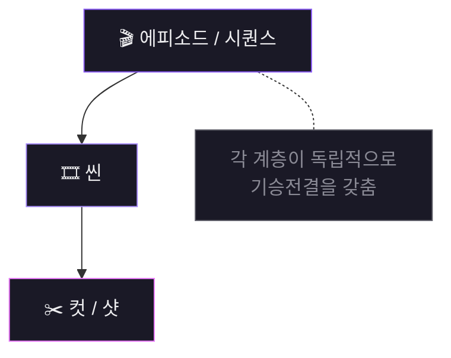
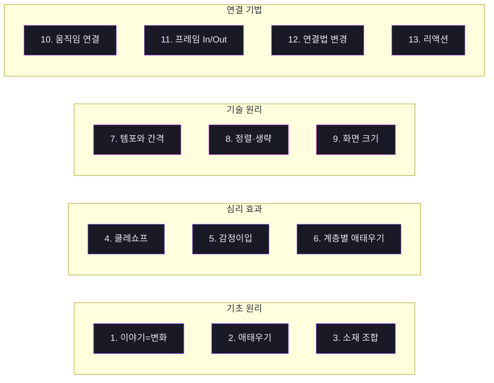
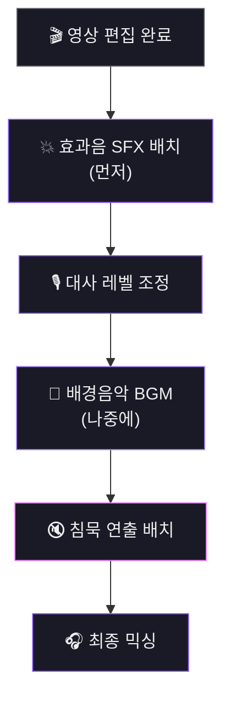

# Part 4. 편집과 완성

## 편집의 기본 원리

### 영화의 계층구조



### 컷의 3가지 동기

<div class="info-grid">
  <div class="info-card">
    <div class="info-icon">💡</div>
    <div class="info-label">정보의 동기</div>
    <div class="info-title">새로운 정보 제공</div>
    <div class="info-desc">관객에게 필요한 정보를 전달하기 위한 컷</div>
  </div>
  <div class="info-card">
    <div class="info-icon">❤️</div>
    <div class="info-label">감정의 동기</div>
    <div class="info-title">감정 강도 변화</div>
    <div class="info-desc">WS→CU = 밀도↑<br>CU→WS = 공허함</div>
  </div>
  <div class="info-card">
    <div class="info-icon">🎵</div>
    <div class="info-label">리듬의 동기</div>
    <div class="info-title">속도감 부여</div>
    <div class="info-desc">시간 흐름의 완급 조절</div>
  </div>
</div>

> **동기 없는 컷은 존재 이유가 없다.**

### 연속 편집 규칙
- **180도 규칙**: 액션 라인 한쪽에서만 촬영 → 좌우 관계 유지
- **30도 규칙**: 같은 피사체 연속 시 앵글 30도 이상 변화 (미만 = 점프 컷)
- **시선 매치**: 시선 방향과 다음 샷 대상의 위치 일치
- **동작 연결**: 동작 중간에 컷 → 관객이 컷을 인식 못 함

---

## 편집의 13가지 원리



1. **이야기 = 변화** → 시간을 압축/확장/재배열하여 변화 설계
2. **애태우기** → 변화를 지연시킬수록 드러나는 순간의 임팩트 극대화
3. **소재 조합** → 개별 샷에 없던 의미가 조합에서 탄생 (관객의 능동적 참여)
4. **쿨레쇼프 효과** → 같은 얼굴 + 다른 맥락 = 다른 감정 → 주변 샷 배치로 감정 유도
5. **감정이입** → 관객의 시점을 캐릭터 시점과 일치시키기 (샷/리버스 샷)
6. **계층별 애태우기** → 샷/씬/시퀀스/영화 전체에서 동일 원리 적용
7. **템포와 간격** → 빠른 컷 = 가속, 긴 샷 = 감속, 블랙 프레임 = 호흡
8. **정렬 순서와 생략** → 보여주지 않는 것이 더 강력 (관객의 상상력 활용)
9. **화면 크기와 인서트** → 샷 사이즈로 감정 강도 조절 + 인서트로 내면 묘사
10. **움직임 연결** → 동작/시선/방향 연결로 매끄러운 컷
11. **프레임 인/아웃** → 씬 시작/끝과 내부 템포 조절
12. **연결법 변경** → 같은 3개 샷의 순서만 바꿔도 전혀 다른 이야기
13. **리액션** → 액션보다 리액션이 더 강력 (듣는 사람의 표정이 대사의 무게를 결정)

---

## 컷 연결의 기본

### 스트레이트 컷이 기본 (90% 이상)

**초보자 4대 함정:**

1. 모든 씬 전환에 디졸브 → 나른하고 늘어진 느낌
2. 트랜지션으로 나쁜 컷 감추기 → 은폐일 뿐 해결이 아님
3. 효과 라이브러리 탐험 → 장식은 이야기를 전달하지 않음
4. 빠른 트랜지션 남발 → 진짜 속도감은 샷 길이와 타이밍에서 나옴

**트랜지션 사용 시점:**

- **디졸브**: 시간 경과, 회상 전환, 감정적 연결
- **페이드**: 이야기의 구조적 단절 (막 전환, 영화 시작/끝)
- **매치 컷**: 형태/움직임/색감 유사성이 이야기 의미를 생성할 때

---

## 사운드와 배경음악



### 효과음 (SFX)

**Kling 3.0 환경음 지시 예시:**
```
Quiet lab. Faint hum of fluorescent lights. Distant mechanical whirring.
Woman walks to the desk. Camera static.
```

**SORA 2 환경음 지시 예시:**
```
Rainy night street. Heavy rain hitting pavement. Distant thunder rumbling.
Man walks slowly under streetlight. Camera tracks alongside.
```

### 배경음악 (BGM) — Suno 활용

**Claude에게 Suno 프롬프트 요청:**

```
아래 장면에 어울리는 배경음악을 Suno로 생성하려고 해. Suno용 프롬프트를 작성해줘.

[해당 장면의 시나리오 붙여넣기]
[해당 장면의 감정 곡선 설명]
[디렉터 노트의 청각 전략 붙여넣기]

프롬프트 조건:
- 인스트루멘탈만 (보컬 없음)
- 장르/스타일 태그 포함
- 분위기 키워드 포함
- 템포 지시 (BPM 또는 느낌으로)
- 악기 구성 지시
- 길이: [장면 길이]에 맞게

Suno의 Custom 모드에 넣을 수 있도록, 스타일 태그와 설명을 분리해서 출력해줘.
```

- Suno Custom 모드의 Styles 부분에 프롬프트 입력, 반드시 `Instrumental` 포함
- 같은 프롬프트로 3~5개 변주 생성 → 장면에 맞는 트랙 선별

### 사운드 배치 원칙

1. **효과음 먼저, 배경음악 나중에**
2. 대사 구간에서 BGM 볼륨 30~50%로 낮춤
3. 음악은 씬 시작 전 진입, 씬 끝 후 퇴장
4. 하나의 씬에 하나의 BGM 트랙
5. **침묵도 연출**: 의도적 소리 제거가 어떤 소리보다 강력할 수 있음

---

## 자막

<div class="info-grid">
  <div class="info-card">
    <div class="info-label">해외 영화제</div>
    <div class="info-title">한글 + 영어 이중자막 필수</div>
    <div class="info-desc">영어 아래 + 한글 위</div>
  </div>
  <div class="info-card">
    <div class="info-label">국내/SNS</div>
    <div class="info-title">한글만 또는 자막 없음</div>
    <div class="info-desc">타겟에 맞게 선택</div>
  </div>
</div>

- 위치: 하단 중앙, 이중자막 시 영어 아래 + 한글 위
- 폰트: 산세리프 (본고딕, 프리텐다드 / Arial, Roboto)
- 가독성: 흰색 텍스트 + 검은색 외곽선 1~2px
- 타이밍: 대사 0.5초 전 등장, 종료 후 1~2초 유지, 자막 간 최소 0.3초 간격
