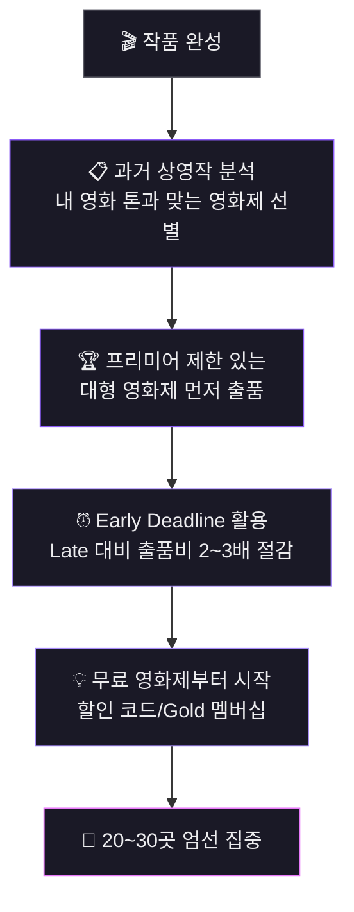
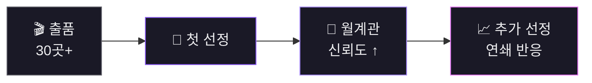

# Part 5. 개봉

## FilmFreeway 출품 가이드

### 프로젝트 등록 필수 항목

  

    
기본 정보

    
제목 (한+영)

    
프로젝트 유형, 러닝타임, 완성 연도, 제작 국가/언어

  

  

    
텍스트

    
시놉시스 + Director's Statement

    
영어, 짧은/긴 버전. Statement는 500단어 이내

  

  

    
비주얼

    
포스터 + 스틸 3~5장

    
트레일러도 있으면 유리

  

### 영화제 선택 전략

---

## 계속 도전해야 하는 이유

  일반 선정률 3~10% | 유명 영화제 1~2% 
  리젝이 정상이다

- **리젝 이유**: 영화 품질 외에도 프로그래밍 균형, 심사위원 취향, 테마 시의성 등 통제 불가 변수
- 30곳 이상 출품하면 자신의 영화와 맞는 영화제를 만날 확률이 올라감
- 첫 번째 선정이 연쇄 반응을 일으킴 (월계관 → 신뢰도 → 추가 선정)

